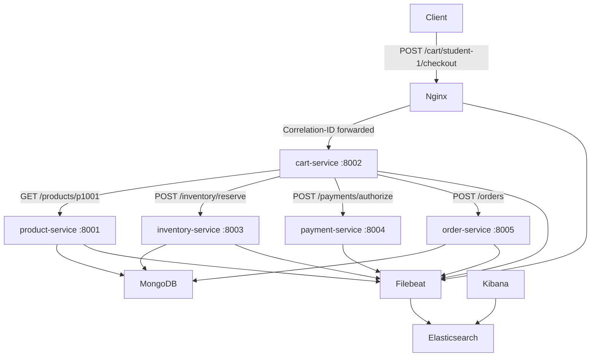
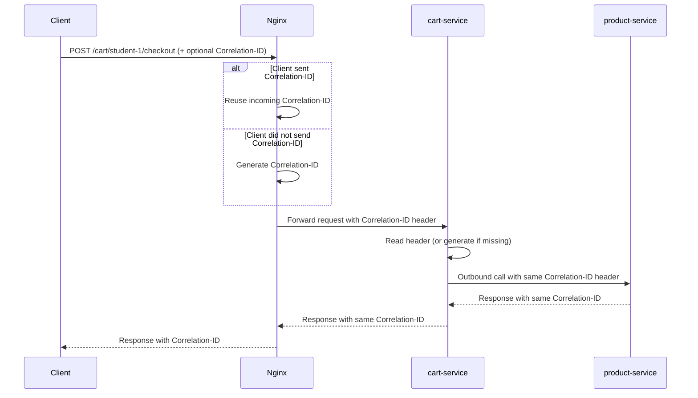

# ecommerce-distributed-tracing-poc

A proof-of-concept e-commerce system built for **IT security students** to learn distributed tracing through correlation IDs and centralized structured logs.

> **Learning goal:** Send one HTTP request, copy the `Correlation-ID` from the response, open Kibana, search for that ID, and reconstruct the complete path of the request through Nginx, five FastAPI services, and MongoDB.

This project demonstrates how to trace one business transaction across multiple services **without** OpenTelemetry or span collectors. Instead, it uses a practical log-based approach: each service emits structured JSON logs with the same correlation ID, Filebeat ships those logs to Elasticsearch, and Kibana is used to rebuild the end-to-end flow.

It can be used for:
- Teaching distributed tracing fundamentals in security and platform courses
- Practicing incident investigation and request-path reconstruction from logs
- Demonstrating safe structured logging patterns (what to log, what to avoid)
- Exploring service-to-service observability in a small microservice environment
- Testing and troubleshooting Filebeat + Elasticsearch log ingestion pipelines

If you are returning to this repository later, start with these docs:
- [docs/architecture.md](docs/architecture.md) - Detailed architecture, flow, and shared module responsibilities
- [docs/kibana-search-guide.md](docs/kibana-search-guide.md) - Step-by-step Kibana workflow to reconstruct a trace
- [docs/security-notes.md](docs/security-notes.md) - Security rationale, logging boundaries, and production caveats
- [docs/path-enumeration.md](docs/path-enumeration.md) - API-only OWASP ZAP path enumeration runbook and validation steps
- [docs/troubleshooting.md](docs/troubleshooting.md) - Docker and Elasticsearch troubleshooting commands used in practice
- [docs/implementation.md](docs/implementation.md) - Internal implementation details for middleware, logging, and Filebeat config
- [tests/README.md](tests/README.md) - Test strategy, smoke suite behavior, and exact test commands

---

## Architecture



---

## Components

| Component | Role | Port |
|---|---|---|
| `nginx` | API gateway, Correlation-ID generation | 8080 |
| `product-service` | Product catalog (MongoDB) | 8001 |
| `cart-service` | Checkout orchestration | 8002 |
| `inventory-service` | Stock management (MongoDB) | 8003 |
| `payment-service` | Mock payment provider | 8004 |
| `order-service` | Order persistence (MongoDB) | 8005 |
| `mongodb` | Database (product_db, inventory_db, order_db) | 27017 |
| `elasticsearch` | Log storage | 9200 |
| `kibana` | Log search UI | 5601 |
| `filebeat` | Ships Docker container logs to Elasticsearch | — |

> **Security note:** Exposing every backend service directly through Nginx is intentional for teaching and debugging purposes. This is **not** a recommended production security design. In production you would expose only the routes required by external clients.

## Known Limitations (POC Scope)

This repository is intentionally optimized for learning and observability, not production hardening.

- No authentication or authorization
- No TLS/HTTPS termination
- No rate limiting or abuse protection
- No production-grade secrets management
- Backend routes are exposed for teaching and debugging visibility

For the full security rationale and production caveats, see [docs/security-notes.md](docs/security-notes.md).

---

## Prerequisites

- [Docker Desktop](https://www.docker.com/products/docker-desktop/) (or Docker Engine + Compose plugin)
- At least 4 GB of free RAM (Elasticsearch requires ~1 GB)
- PowerShell 5.1+ (for running `health_check.ps1` on Windows)

---

## Quick Start

### 1. Start the system

```bash
docker compose up --build
```

Wait approximately 30–60 seconds for Elasticsearch and MongoDB to finish initialising.

### 2. Verify all services are healthy

<!-- **Bash script (Linux/macOS/WSL):**
```bash
./scripts/health_check.sh
``` -->

**PowerShell script (Windows):**
```powershell
.\scripts\health_check.ps1
```

Expected output:
```
[OK]   product-service   -> HTTP 200
[OK]   cart-service      -> HTTP 200
[OK]   inventory-service -> HTTP 200
[OK]   payment-service   -> HTTP 200
[OK]   order-service     -> HTTP 200
All services are healthy.
```

### 3. Send the demo checkout request

<!-- **Bash script (Linux/macOS/WSL):**
```bash
./scripts/demo_checkout.sh
``` -->

**PowerShell script (Windows):**
```powershell
.\scripts\demo_checkout.ps1
```

**Postman collection:**
- Import [postman/ecommerce-distributed-tracing-poc.postman_collection.json](postman/ecommerce-distributed-tracing-poc.postman_collection.json) into Postman.
- Use `Health Checks` to test all five services through Nginx.
- Run `Checkout Flow / Demo Checkout` against `{{baseUrl}} = http://localhost:8080`.
- The collection stores the response Correlation-ID in `lastCorrelationId` for reuse.
- Run `Checkout Flow / Search Trace in Elasticsearch` to fetch matching log entries directly from `{{elasticsearchUrl}} = http://localhost:9200`.

<!-- **Python script (cross-platform):**
```bash
pip install httpx
python scripts/demo_checkout.py
``` -->

**Raw curl (Bash):**
```bash
curl -i -X POST http://localhost:8080/cart/student-1/checkout \
  -H "Content-Type: application/json" \
  -d '{"items": [{"product_id": "p1001", "quantity": 2}]}'
```

**Raw curl (PowerShell):**
```powershell
curl.exe -i -X POST http://localhost:8080/cart/student-1/checkout `
  -H "Content-Type: application/json" `
  --data-raw '{"items":[{"product_id":"p1001","quantity":2}]}'
```

> **Note:** In PowerShell, `curl` is an alias for `Invoke-WebRequest`. Use `curl.exe` if you want the actual curl CLI.

Copy the `Correlation-ID` value from the response header.

---

## Finding the Request Trace in Kibana

1. Open **http://localhost:5601**
2. Go to **Management → Stack Management → Index Patterns** (or **Data Views** in newer Kibana)
3. Create a data view with the pattern `filebeat-*`, using `@timestamp` as the time field
4. Go to **Discover**
5. In the search bar enter:
   ```
   correlation_id : "<paste-your-id-here>"
   ```
6. Sort by **timestamp ascending**
7. You will see log entries from: `nginx`, `cart-service`, `product-service`, `inventory-service`, `payment-service`, `order-service`

See [docs/kibana-search-guide.md](docs/kibana-search-guide.md) for a detailed walkthrough.

---

## Correlation IDs Explained

Every request that arrives at Nginx gets a **Correlation-ID context** that travels through every service involved in handling that request.

### Conceptual Flow (Nginx -> cart-service -> upstream)



> **Note on Nginx Log Timing:** Nginx emits its access log when the response is _completed_ (not when the request arrives). When you search Kibana by correlation ID and sort by timestamp, the Nginx access log may appear _after_ the first application log from cart-service. This is expected behavior—the log entries should be chronologically ordered by their actual timestamps, which means backend services log their `request_received` events before Nginx finishes and logs the access event.

In practical terms:
- Nginx is the entry point. It preserves an incoming `Correlation-ID` or generates one if the client did not send one.
- Nginx forwards that value upstream as a request header.
- `cart-service` stores that same ID in `request.state`, logs it, and reuses it on outbound calls.
- Every downstream service logs the same ID, so one Kibana search reconstructs the whole path.
- Services also log whether the ID came from an incoming header or was generated, using `correlation_id_source`.

- If the client sends a `Correlation-ID` header, Nginx preserves it.
- If the client does not send one, Nginx generates a request identifier automatically.
- Every service reads the header, adds it to every log entry, and forwards it on every outbound HTTP call.
- The application services return the `Correlation-ID` in the response header and body.
- Nginx no longer adds a second `Correlation-ID` response header, which avoids duplicated values at the client.

This means that all log lines for a single request share the same `correlation_id` field, making it possible to search Kibana for one ID and see the complete trace.

---

## Event Names Reference

Every log entry includes an `event_name` field that describes what is happening. This makes it easy to search and filter logs by activity type in Kibana. Here's a complete reference:

### Universal Events (All Services)
- **`request_received`** – Service received an HTTP request from upstream
- **`request_completed`** – Service finished processing and sent response upstream

### Checkout Orchestration (cart-service)
- **`checkout_started`** – User initiated checkout
- **`product_lookup_started`** – Querying product-service for item details
- **`product_lookup_completed`** – Product details retrieved
- **`inventory_reservation_started`** – Requesting inventory reservation from inventory-service
- **`inventory_reservation_completed`** – Inventory reservation response received
- **`payment_authorization_started`** – Requesting payment authorization from payment-service
- **`payment_authorization_completed`** – Payment response received
- **`order_creation_started`** – Requesting order creation from order-service
- **`checkout_completed`** – Entire checkout flow finished successfully

### HTTP Communication (shared library)
- **`outbound_http_request`** – Service is about to make an HTTP call to another service
- **`outbound_http_response`** – Received response from outbound HTTP call
- **`retry_attempt`** – Retrying a failed HTTP request (part of retry logic)

### Database Operations
- **`database_query`** – Executing a database read operation
- **`database_write`** – Executing a database write operation

### Service-Specific Events
**Inventory Service:**
- **`inventory_reservation_started`** – Beginning to reserve inventory units
- **`inventory_reservation_completed`** – Inventory reservation finished

**Payment Service:**
- **`payment_authorization_started`** – Beginning payment authorization
- **`payment_authorization_completed`** – Payment authorization finished (includes `status_text: approved/declined`)

**Order Service:**
- **`order_creation_started`** – Beginning to create order record
- **`order_creation_completed`** – Order creation finished

### Searching by Event in Kibana

To find all logs of a specific event type, use:
```
event_name : "checkout_started"
```

To find all events for a checkout that also had a specific event:
```
correlation_id : "your-id" AND event_name : "payment_authorization_completed"
```

To find all failed payment attempts:
```
event_name : "payment_authorization_completed" AND status_text : "declined"
```

---

## Why Structured JSON Logs?

All services log JSON objects to stdout/stderr. Docker captures these and Filebeat ships them to Elasticsearch.

Filebeat reads Docker JSON log files with the supported `filestream` input plus the Docker `container` parser. This avoids the deprecated legacy log input and keeps the stack aligned with current Filebeat guidance.

Benefits:
- Every field is individually searchable in Kibana (e.g., `event_name`, `status_code`, `duration_ms`)
- No fragile log parsing is needed
- Adding `correlation_id` as a field makes cross-service correlation trivial

---

## Why You Must Not Log Sensitive Data

Logs are valuable security evidence — but they can also become a liability.

**Never log:**
- Payment card numbers (PAN), CVV, or expiry dates
- Passwords or password hashes
- API tokens or session tokens
- Full request bodies that may contain any of the above
- Any personal data beyond what is operationally necessary

**You may log:**
- Product IDs, order IDs, transaction IDs
- Amounts and currencies (not card details)
- HTTP methods, paths, status codes, durations
- Internal service names and event names

This project enforces these rules in all service code. See [docs/security-notes.md](docs/security-notes.md) for full details.

---

## Security Path Enumeration (OWASP ZAP)

This repository includes an API-only path enumeration workflow for local lab use.

- Scanner service: `security-scanner` (OWASP ZAP daemon)
- ZAP API endpoint: `http://localhost:8090`
- Target from scanner network: `http://nginx:80`
- Wordlists: all files under `security/wordlists/`
- Output report: `security/reports/zap_paths_<timestamp>.json`

Run:

```powershell
docker compose up -d
powershell -ExecutionPolicy Bypass -File .\scripts\security_scan.ps1
```

For the security rationale and guardrails, see [docs/security-notes.md](docs/security-notes.md#path-enumeration-with-owasp-zap). For step-by-step execution and validation, see [docs/path-enumeration.md](docs/path-enumeration.md).

---

## Running the Tests

The tests are integration tests — they require the full stack to be running.

Create and activate a virtual environment first:

**PowerShell (Windows):**

```powershell
python -m venv .venv
.\.venv\Scripts\Activate.ps1
```

**Bash (Linux/macOS/WSL):**

```bash
python -m venv .venv
source .venv/bin/activate
```

```bash
pip install pytest httpx
pytest tests/ -v
```

Smoke test suite (self-managed environment):

```bash
pip install pytest
pytest tests/smoke -v
```

The smoke suite will:
- Start the full stack directly via `docker compose up --build -d`
- Execute one checkout request
- Validate docker logs and Filebeat health signals
- Query Elasticsearch directly for the trace
- Validate expected fields for key events

Set `SMOKE_KEEP_ENV=1` if you want to keep containers running after the smoke tests complete.

See [tests/README.md](tests/README.md) for the full test guide and coverage details.

---

## Troubleshooting

| Symptom | Likely cause | Fix |
|---|---|---|
| Kibana shows no logs | Filebeat not started / ES still initialising | Wait 60 s and refresh; check `docker compose logs filebeat` |
| `curl` returns 502 | A FastAPI service is still starting | Wait a few seconds and retry |
| MongoDB seed data missing | Init scripts did not run on first start | Run `docker compose down -v` then `docker compose up --build` |
| Elasticsearch container exits | Not enough memory | Increase Docker Desktop memory to at least 4 GB |
<!-- | Permission error on `health_check.sh` | Script not executable | Run `chmod +x scripts/*.sh` | -->

---

## Cleanup

Stop the system and remove all volumes (including MongoDB and Elasticsearch data):

```bash
docker compose down -v
```

Remove built images:

```bash
docker compose down --rmi all -v
```

View volumes associated with this project:

```bash
docker volume ls | grep e_commerce
```

Remove specific volumes manually (if needed):

```bash
docker volume rm e_commerce_distributed_tracing_poc_mongodb_data
docker volume rm e_commerce_distributed_tracing_poc_elasticsearch_data
```

Or remove all unused volumes in Docker:

```bash
docker volume prune
```
