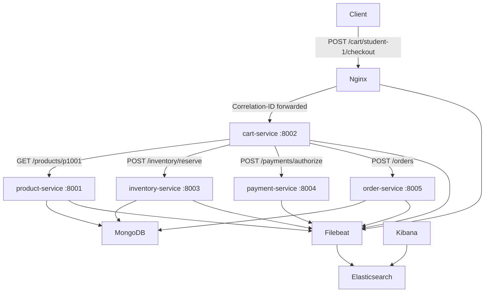

# ecommerce-distributed-tracing-poc

A proof-of-concept e-commerce system built for **IT security students** to learn distributed tracing through correlation IDs and centralized structured logs.

> **Learning goal:** Send one HTTP request, copy the `Correlation-ID` from the response, open Kibana, search for that ID, and reconstruct the complete path of the request through Nginx, five FastAPI services, and MongoDB.

---

## Architecture



---

## Components

| Component | Role | Port |
|---|---|---|
| `nginx` | API gateway, Correlation-ID generation | 8080 |
| `product-service` | Product catalog (MongoDB) | 8001 |
| `cart-service` | Checkout orchestration | 8002 |
| `inventory-service` | Stock management (MongoDB) | 8003 |
| `payment-service` | Mock payment provider | 8004 |
| `order-service` | Order persistence (MongoDB) | 8005 |
| `mongodb` | Database (product_db, inventory_db, order_db) | 27017 |
| `elasticsearch` | Log storage | 9200 |
| `kibana` | Log search UI | 5601 |
| `filebeat` | Ships Docker container logs to Elasticsearch | — |

> **Security note:** Exposing every backend service directly through Nginx is intentional for teaching and debugging purposes. This is **not** a recommended production security design. In production you would expose only the routes required by external clients.

---

## Prerequisites

- [Docker Desktop](https://www.docker.com/products/docker-desktop/) (or Docker Engine + Compose plugin)
- At least 4 GB of free RAM (Elasticsearch requires ~1 GB)
- PowerShell 5.1+ (for running `health_check.ps1` on Windows)

---

## Quick Start

### 1. Start the system

```bash
docker compose up --build
```

Wait approximately 30–60 seconds for Elasticsearch and MongoDB to finish initialising.

### 2. Verify all services are healthy

**Bash script (Linux/macOS/WSL):**
```bash
./scripts/health_check.sh
```

**PowerShell script (Windows):**
```powershell
.\scripts\health_check.ps1
```

Expected output:
```
[OK]   product-service   -> HTTP 200
[OK]   cart-service      -> HTTP 200
[OK]   inventory-service -> HTTP 200
[OK]   payment-service   -> HTTP 200
[OK]   order-service     -> HTTP 200
All services are healthy.
```

### 3. Send the demo checkout request

**Bash script (Linux/macOS/WSL):**
```bash
./scripts/demo_checkout.sh
```

**PowerShell script (Windows):**
```powershell
.\scripts\demo_checkout.ps1
```

**Python script (cross-platform):**
```bash
pip install httpx
python scripts/demo_checkout.py
```

**Raw curl (Bash):**
```bash
curl -i -X POST http://localhost:8080/cart/student-1/checkout \
  -H "Content-Type: application/json" \
  -d '{"items": [{"product_id": "p1001", "quantity": 2}]}'
```

**Raw curl (PowerShell):**
```powershell
curl.exe -i -X POST http://localhost:8080/cart/student-1/checkout `
  -H "Content-Type: application/json" `
  --data-raw "{\"items\":[{\"product_id\":\"p1001\",\"quantity\":2}]}"
```

> **Note:** In PowerShell, `curl` is an alias for `Invoke-WebRequest`. Use `curl.exe` if you want the actual curl CLI.

Copy the `Correlation-ID` value from the response header.

---

## Finding the Request Trace in Kibana

1. Open **http://localhost:5601**
2. Go to **Management → Stack Management → Index Patterns** (or **Data Views** in newer Kibana)
3. Create a data view with the pattern `filebeat-*`, using `@timestamp` as the time field
4. Go to **Discover**
5. In the search bar enter:
   ```
   correlation_id : "<paste-your-id-here>"
   ```
6. Sort by **timestamp ascending**
7. You will see log entries from: `nginx`, `cart-service`, `product-service`, `inventory-service`, `payment-service`, `order-service`

See [docs/kibana-search-guide.md](docs/kibana-search-guide.md) for a detailed walkthrough.

---

## Correlation IDs Explained

Every request that arrives at Nginx is assigned a **Correlation-ID** — a unique UUID that travels through every service involved in handling that request.

- If the client sends a `Correlation-ID` header, Nginx preserves it.
- If the client does not send one, Nginx generates a UUID automatically.
- Every service reads the header, adds it to every log entry, and forwards it on every outbound HTTP call.
- Every service returns the same `Correlation-ID` in the response header and body.

This means that all log lines for a single request share the same `correlation_id` field, making it possible to search Kibana for one ID and see the complete trace.

---

## Why Structured JSON Logs?

All services log JSON objects to stdout/stderr. Docker captures these and Filebeat ships them to Elasticsearch.

Benefits:
- Every field is individually searchable in Kibana (e.g., `event`, `status_code`, `duration_ms`)
- No fragile log parsing is needed
- Adding `correlation_id` as a field makes cross-service correlation trivial

---

## Why You Must Not Log Sensitive Data

Logs are valuable security evidence — but they can also become a liability.

**Never log:**
- Payment card numbers (PAN), CVV, or expiry dates
- Passwords or password hashes
- API tokens or session tokens
- Full request bodies that may contain any of the above
- Any personal data beyond what is operationally necessary

**You may log:**
- Product IDs, order IDs, transaction IDs
- Amounts and currencies (not card details)
- HTTP methods, paths, status codes, durations
- Internal service names and event names

This project enforces these rules in all service code. See [docs/security-notes.md](docs/security-notes.md) for full details.

---

## Running the Tests

The tests are integration tests — they require the full stack to be running.

```bash
pip install pytest httpx
pytest tests/ -v
```

---

## Troubleshooting

| Symptom | Likely cause | Fix |
|---|---|---|
| Kibana shows no logs | Filebeat not started / ES still initialising | Wait 60 s and refresh; check `docker compose logs filebeat` |
| `curl` returns 502 | A FastAPI service is still starting | Wait a few seconds and retry |
| MongoDB seed data missing | Init scripts did not run on first start | Run `docker compose down -v` then `docker compose up --build` |
| Elasticsearch container exits | Not enough memory | Increase Docker Desktop memory to at least 4 GB |
| Permission error on `health_check.sh` | Script not executable | Run `chmod +x scripts/*.sh` |

---

## Cleanup

Stop the system and remove all volumes (including MongoDB and Elasticsearch data):

```bash
docker compose down -v
```

Remove built images:

```bash
docker compose down --rmi all -v
```
