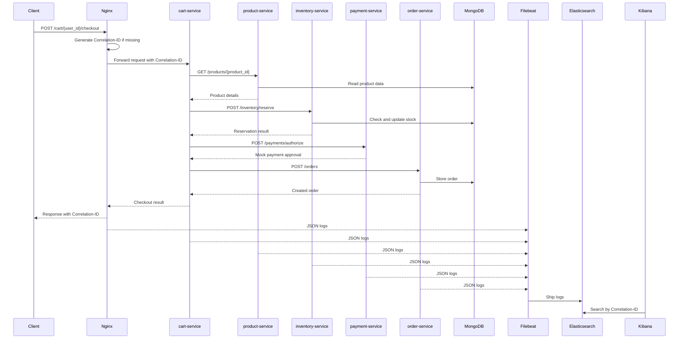

# ecommerce-distributed-tracing-poc — Specification

## 1. Purpose

Create a proof-of-concept e-commerce system that demonstrates distributed tracing through correlation IDs and centralized structured logs.

The system is designed for IT security students. The learning goal is that a student can send one HTTP request, copy the returned `Correlation-ID`, open Kibana, search for that ID, and reconstruct the complete path of the request through Nginx, FastAPI services, MongoDB-backed services, retries, and downstream HTTP calls.

This project intentionally uses log-based distributed tracing rather than span-based tracing. The trace is reconstructed in Kibana by correlating structured JSON logs that all contain the same `Correlation-ID`.

## 2. Project Name

`ecommerce-distributed-tracing-poc`

## 3. Core Requirements

The generated project must include everything needed to run the POC locally:

* Docker Compose environment
* Nginx reverse proxy/API gateway
* 5 FastAPI services
* MongoDB
* Elasticsearch
* Kibana
* Filebeat
* Service Dockerfiles
* Nginx configuration
* Filebeat configuration
* MongoDB seed/init data
* Shared Python utilities
* README instructions
* Kibana search instructions
* Health-check tests
* End-to-end checkout script
* Mermaid architecture diagram

The project must be generated so that a developer can clone it, run one setup command, send a request, and inspect the correlated logs in Kibana.

## 4. Architectural Overview

### 4.1 Components

The system contains:

1. `nginx`

   * Public entry point
   * Routes traffic to all FastAPI services
   * Generates the `Correlation-ID` request header if the client did not provide one
   * Logs structured JSON access logs

2. `product-service`

   * FastAPI service
   * Reads product data from MongoDB
   * Participates in correlation ID logging

3. `cart-service`

   * FastAPI service
   * Owns the main checkout endpoint
   * Orchestrates the checkout flow
   * Calls Product, Inventory, Payment, and Order services
   * Forwards the same `Correlation-ID` on all downstream calls

4. `inventory-service`

   * FastAPI service
   * Reads inventory data from MongoDB
   * Checks and reserves stock
   * Participates in correlation ID logging

5. `payment-service`

   * FastAPI service
   * Uses a static mock payment provider object
   * Always succeeds when given valid input
   * Returns a fake transaction ID
   * Participates in correlation ID logging

6. `order-service`

   * FastAPI service
   * Stores completed orders in MongoDB
   * Participates in correlation ID logging

7. `mongodb`

   * Single MongoDB container
   * Separate logical databases per service:

     * `product_db`
     * `inventory_db`
     * `order_db`

8. `filebeat`

   * Reads Docker container logs
   * Ships logs directly to Elasticsearch
   * Logstash must be omitted

9. `elasticsearch`

   * Stores logs

10. `kibana`

* Used by students to search logs by `Correlation-ID`

### 4.2 Request Flow

Main demo flow:



## 5. Correlation ID Requirements

### 5.1 Header Name

The correlation header must be:

```http
Correlation-ID: <uuid-or-request-id>
```

### 5.2 Generation

Nginx must generate `Correlation-ID` when the incoming client request does not provide one.

If the client provides a `Correlation-ID`, Nginx must preserve and forward it.

### 5.3 Propagation

Every FastAPI service must:

* Read the incoming `Correlation-ID` request header
* Include it in every structured log entry related to that request
* Forward the same `Correlation-ID` header on every outbound HTTP call
* Return the same `Correlation-ID` in the response headers
* Include the `correlation_id` in response bodies where appropriate

### 5.4 Response Header

Every public endpoint must return:

```http
Correlation-ID: <same-id>
```

For business endpoints, the response body should also include:

```json
{
  "correlation_id": "<same-id>"
}
```

## 6. Logging Requirements

### 6.1 Format

All logs must be structured JSON.

Every service log line must be a single JSON object printed to stdout/stderr so Docker captures it and Filebeat can ship it.

### 6.2 Minimum Fields

Every application log entry must include:

```json
{
  "timestamp": "2026-01-01T12:00:00.000Z",
  "level": "INFO",
  "service_name": "cart-service",
  "correlation_id": "example-correlation-id",
  "event": "request_received",
  "method": "POST",
  "path": "/cart/student-1/checkout",
  "status_code": 200,
  "duration_ms": 42
}
```

Use `correlation_id` in JSON logs even though the HTTP header is named `Correlation-ID`.

### 6.3 Event Names

Use consistent event names. Required examples:

* `request_received`
* `request_completed`
* `outbound_http_request`
* `outbound_http_response`
* `database_query`
* `database_write`
* `retry_attempt`
* `checkout_started`
* `checkout_completed`
* `product_lookup_started`
* `product_lookup_completed`
* `inventory_reservation_started`
* `inventory_reservation_completed`
* `payment_authorization_started`
* `payment_authorization_completed`
* `order_creation_started`
* `order_creation_completed`

### 6.4 Outbound HTTP Logs

Every outbound HTTP call must log at least:

```json
{
  "timestamp": "2026-01-01T12:00:00.000Z",
  "level": "INFO",
  "service": "cart-service",
  "correlation_id": "example-correlation-id",
  "event": "outbound_http_request",
  "target_service": "product-service",
  "target_url": "http://product-service:8001/products/p1001",
  "method": "GET",
  "retry_attempt": 1,
  "max_attempts": 3
}
```

And the response:

```json
{
  "timestamp": "2026-01-01T12:00:00.000Z",
  "level": "INFO",
  "service": "cart-service",
  "correlation_id": "example-correlation-id",
  "event": "outbound_http_response",
  "target_service": "product-service",
  "status_code": 200,
  "duration_ms": 23,
  "retry_attempt": 1,
  "max_attempts": 3
}
```

### 6.5 Retry Logs

All outbound HTTP service-to-service calls must use retries.

Retry behavior:

* 3 total attempts
* Log attempt 1 even when it succeeds
* Use the fields:

  * `retry_attempt`
  * `max_attempts`
  * `target_service`
  * `target_url`
  * `duration_ms`

Nothing in the system should intentionally fail. Retries should still be implemented and visible in the logs on the first successful attempt.

### 6.6 Database Logs

Services that use MongoDB must log database operations with safe metadata only.

Example:

```json
{
  "timestamp": "2026-01-01T12:00:00.000Z",
  "level": "INFO",
  "service": "order-service",
  "correlation_id": "example-correlation-id",
  "event": "database_write",
  "database": "order_db",
  "collection": "orders",
  "operation": "insert_one",
  "duration_ms": 12,
  "order_id": "ord_123"
}
```

### 6.7 Sensitive Data Rules

Do not log full request bodies.

Logs may include safe metadata only, such as:

* Product IDs
* Quantities
* Order IDs
* Transaction IDs
* Service names
* Endpoint paths
* Status codes
* Durations

Logs must not include:

* Payment card data
* Passwords
* Tokens
* Secrets
* Full request bodies
* Sensitive personal data

The README must explain why this matters for IT security students.

### 6.8 Nginx JSON Logs

Nginx must log JSON access logs that include:

```json
{
  "timestamp": "2026-01-01T12:00:00+00:00",
  "service_name": "nginx",
  "correlation_id": "example-correlation-id",
  "remote_addr": "172.18.0.1",
  "request_method": "POST",
  "request_uri": "/cart/student-1/checkout",
  "status": 200,
  "request_time": 0.123,
  "upstream_addr": "cart-service:8002",
  "upstream_response_time": "0.120"
}
```

## 7. Technology Stack

### 7.1 Application Services

Use:

* Python 3.12
* FastAPI
* Uvicorn
* httpx for service-to-service HTTP calls
* pymongo for MongoDB access
* tenacity for retry handling
* JSON logging to stdout/stderr

### 7.2 Infrastructure

Use:

* Docker Compose
* Nginx
* MongoDB
* Elasticsearch
* Kibana
* Filebeat

Do not include Logstash.

## 8. Service List and Responsibilities

### 8.1 product-service

Purpose:

* Serve product catalog data
* Read from MongoDB database `product_db`

Required endpoints:

```http
GET /health
GET /products
GET /products/{product_id}
```

Example product response:

```json
{
  "product_id": "p1001",
  "name": "Mechanical Keyboard",
  "price": 799.0,
  "currency": "DKK",
  "correlation_id": "example-correlation-id"
}
```

### 8.2 cart-service

Purpose:

* Own the main checkout flow
* Receive the main demo request
* Call Product, Inventory, Payment, and Order services

Required endpoints:

```http
GET /health
POST /cart/{user_id}/checkout
```

Checkout request body:

```json
{
  "items": [
    {
      "product_id": "p1001",
      "quantity": 2
    }
  ]
}
```

Checkout behavior:

1. Receive checkout request
2. Log `checkout_started`
3. For each item, call Product Service to fetch product data
4. Call Inventory Service to reserve stock
5. Call Payment Service to authorize mock payment
6. Call Order Service to create the order
7. Log `checkout_completed`
8. Return order result and correlation ID

Successful response:

```json
{
  "status": "success",
  "order_id": "ord_123456",
  "correlation_id": "example-correlation-id",
  "message": "Order created successfully"
}
```

### 8.3 inventory-service

Purpose:

* Check and reserve stock
* Use MongoDB database `inventory_db`

Required endpoints:

```http
GET /health
GET /inventory/{product_id}
POST /inventory/reserve
```

Reserve request:

```json
{
  "items": [
    {
      "product_id": "p1001",
      "quantity": 2
    }
  ]
}
```

Reserve response:

```json
{
  "status": "reserved",
  "reservation_id": "res_123456",
  "correlation_id": "example-correlation-id"
}
```

The service should update stock in MongoDB. Nothing should intentionally fail, so seed enough stock for demo requests.

### 8.4 payment-service

Purpose:

* Simulate payment authorization using a static mock provider object
* Always approve valid requests
* Return fake transaction IDs

Required endpoints:

```http
GET /health
POST /payments/authorize
```

Payment request:

```json
{
  "user_id": "student-1",
  "amount": 1598.0,
  "currency": "DKK"
}
```

Payment response:

```json
{
  "status": "approved",
  "transaction_id": "txn_123456",
  "correlation_id": "example-correlation-id"
}
```

### 8.5 order-service

Purpose:

* Create and store orders
* Use MongoDB database `order_db`

Required endpoints:

```http
GET /health
POST /orders
GET /orders/{order_id}
```

Create order request:

```json
{
  "user_id": "student-1",
  "items": [
    {
      "product_id": "p1001",
      "quantity": 2,
      "unit_price": 799.0
    }
  ],
  "payment": {
    "transaction_id": "txn_123456",
    "status": "approved"
  },
  "reservation_id": "res_123456",
  "total_amount": 1598.0,
  "currency": "DKK"
}
```

Create order response:

```json
{
  "status": "created",
  "order_id": "ord_123456",
  "correlation_id": "example-correlation-id"
}
```

## 9. Nginx Requirements

### 9.1 Public Port

Expose Nginx on host port:

```text
8080
```

Example base URL:

```text
http://localhost:8080
```

### 9.2 Route All Service Routes

Nginx must expose all service routes publicly for teaching and debugging.

Suggested routing:

```text
/products/*    -> product-service:8001
/cart/*        -> cart-service:8002
/inventory/*   -> inventory-service:8003
/payments/*    -> payment-service:8004
/orders/*      -> order-service:8005
```

Health routes should also be available through Nginx:

```text
/product-health    -> product-service:8001/health
/cart-health       -> cart-service:8002/health
/inventory-health  -> inventory-service:8003/health
/payment-health    -> payment-service:8004/health
/order-health      -> order-service:8005/health
```

The README must explicitly state that exposing all internal services through Nginx is for educational purposes and is not a recommended production security design.

### 9.3 Correlation ID Generation in Nginx

Nginx must:

* Check for an incoming `Correlation-ID` header
* Preserve it if present
* Generate one if missing
* Forward the final value to the upstream service
* Include it in Nginx JSON access logs
* Return it to the client as a response header

Implementation approach can use Nginx variables, `map`, and `$request_id`.

## 10. Docker Compose Requirements

The `docker-compose.yml` must define:

* `nginx`
* `product-service`
* `cart-service`
* `inventory-service`
* `payment-service`
* `order-service`
* `mongodb`
* `elasticsearch`
* `kibana`
* `filebeat`

### 10.1 Service Ports

Use predictable service ports:

```text
product-service:   8001
cart-service:      8002
inventory-service: 8003
payment-service:   8004
order-service:     8005
```

Nginx exposes host port `8080`.

Kibana exposes host port `5601`.

Elasticsearch exposes host port `9200` if needed.

MongoDB exposes host port `27017` if useful for local debugging.

### 10.2 Dependencies

Application services should depend on MongoDB only if they use MongoDB.

Nginx should depend on all FastAPI services.

Kibana and Filebeat should depend on Elasticsearch.

Filebeat must have access to Docker container logs.

## 11. Project Structure

Copilot should generate a structure similar to:

```text
ecommerce-distributed-tracing-poc/
  README.md
  SPEC.md
  docker-compose.yml
  .env.example
  nginx/
    nginx.conf
  filebeat/
    filebeat.yml
  mongodb/
    init/
      seed_products.js
      seed_inventory.js
  shared/
    __init__.py
    correlation.py
    logging.py
    http_client.py
    retry.py
    responses.py
  services/
    product-service/
      Dockerfile
      requirements.txt
      app/
        main.py
        database.py
        models.py
        routes.py
    cart-service/
      Dockerfile
      requirements.txt
      app/
        main.py
        models.py
        routes.py
        checkout.py
    inventory-service/
      Dockerfile
      requirements.txt
      app/
        main.py
        database.py
        models.py
        routes.py
    payment-service/
      Dockerfile
      requirements.txt
      app/
        main.py
        models.py
        routes.py
        mock_provider.py
    order-service/
      Dockerfile
      requirements.txt
      app/
        main.py
        database.py
        models.py
        routes.py
  scripts/
    health_check.sh
    demo_checkout.sh
    demo_checkout.py
  tests/
    test_health.py
    test_checkout_flow.py
  docs/
    architecture.md
    kibana-search-guide.md
    security-notes.md
```

Each service should have its own Dockerfile.

Shared helper code must live in the top-level `shared/` package and be copied into each service image or mounted appropriately for local development.

## 12. Shared Python Utilities

### 12.1 `shared/correlation.py`

Responsibilities:

* Define header constant: `Correlation-ID`
* Extract correlation ID from request headers
* Add correlation ID to response headers
* Provide FastAPI middleware helper if useful

### 12.2 `shared/logging.py`

Responsibilities:

* Configure JSON logging
* Ensure every log line includes:

  * timestamp
  * level
  * service
  * correlation_id
  * event
* Avoid logging sensitive request bodies

### 12.3 `shared/http_client.py`

Responsibilities:

* Wrap `httpx` outbound calls
* Automatically forward `Correlation-ID`
* Log outbound request and response events
* Use retry logic

### 12.4 `shared/retry.py`

Responsibilities:

* Configure 3 total attempts
* Integrate with tenacity
* Expose reusable retry settings
* Ensure attempt number is logged

### 12.5 `shared/responses.py`

Responsibilities:

* Helpers for consistent response format
* Helpers for adding `correlation_id` to response bodies

## 13. MongoDB Requirements

Use one MongoDB container with separate databases.

### 13.1 Databases

```text
product_db
inventory_db
order_db
```

### 13.2 Collections

```text
product_db.products
inventory_db.inventory
order_db.orders
```

### 13.3 Seed Data

Seed products:

```json
[
  {
    "product_id": "p1001",
    "name": "Mechanical Keyboard",
    "price": 799.0,
    "currency": "DKK"
  },
  {
    "product_id": "p1002",
    "name": "Wireless Mouse",
    "price": 299.0,
    "currency": "DKK"
  },
  {
    "product_id": "p1003",
    "name": "USB-C Docking Station",
    "price": 1199.0,
    "currency": "DKK"
  }
]
```

Seed inventory:

```json
[
  {
    "product_id": "p1001",
    "stock": 100
  },
  {
    "product_id": "p1002",
    "stock": 100
  },
  {
    "product_id": "p1003",
    "stock": 100
  }
]
```

Orders are created during demo requests.

## 14. Filebeat and Elasticsearch Requirements

### 14.1 Filebeat

Filebeat must:

* Read Docker container logs
* Preserve JSON log fields where possible
* Send directly to Elasticsearch
* Omit Logstash

### 14.2 Elasticsearch Indexing

Use a simple index pattern such as:

```text
filebeat-*
```

or another clear project-specific pattern if easier.

### 14.3 Kibana Instructions

The README or `docs/kibana-search-guide.md` must explain how to:

1. Open Kibana at `http://localhost:5601`
2. Create/select the Filebeat data view
3. Open Discover
4. Search by correlation ID
5. Sort logs by timestamp
6. Reconstruct the request path through:

   * Nginx
   * Cart Service
   * Product Service
   * Inventory Service
   * Payment Service
   * Order Service
   * MongoDB-related logs

Example Kibana query:

```text
correlation_id : "<copied-correlation-id>"
```

Also mention that Nginx logs may use the same field name, `correlation_id`.

## 15. Endpoints Summary

### 15.1 Product Service

```http
GET /health
GET /products
GET /products/{product_id}
```

### 15.2 Cart Service

```http
GET /health
POST /cart/{user_id}/checkout
```

### 15.3 Inventory Service

```http
GET /health
GET /inventory/{product_id}
POST /inventory/reserve
```

### 15.4 Payment Service

```http
GET /health
POST /payments/authorize
```

### 15.5 Order Service

```http
GET /health
POST /orders
GET /orders/{order_id}
```

## 16. Health Checks

Every FastAPI service must implement:

```http
GET /health
```

Response:

```json
{
  "status": "ok",
  "service": "product-service",
  "correlation_id": "example-correlation-id"
}
```

The health endpoint must also return the `Correlation-ID` response header.

## 17. Scripts

### 17.1 `scripts/health_check.sh`

Must call all public health endpoints through Nginx:

```bash
curl -i http://localhost:8080/product-health
curl -i http://localhost:8080/cart-health
curl -i http://localhost:8080/inventory-health
curl -i http://localhost:8080/payment-health
curl -i http://localhost:8080/order-health
```

The script should fail if any endpoint does not return HTTP 200.

### 17.2 `scripts/demo_checkout.sh`

Must send the main checkout request through Nginx:

```bash
curl -i -X POST http://localhost:8080/cart/student-1/checkout \
  -H "Content-Type: application/json" \
  -d '{
    "items": [
      { "product_id": "p1001", "quantity": 2 }
    ]
  }'
```

The script should print the response and clearly show the returned `Correlation-ID` header.

### 17.3 `scripts/demo_checkout.py`

Optional but recommended.

Must:

* Send checkout request
* Print status code
* Print response body
* Print `Correlation-ID`
* Print a suggested Kibana query

Example output:

```text
Checkout completed.
Status: 200
Correlation-ID: 3d9f4c9b5e0c4b1aa0b9e8d8c7f6a5e1

Open Kibana Discover and search:
correlation_id : "3d9f4c9b5e0c4b1aa0b9e8d8c7f6a5e1"
```

## 18. Tests

Include basic tests.

The tests in `tests/` and `tests/smoke/` are part of the implementation contract.
The project is not considered complete unless these tests pass.

### 18.0 Generic Test Contract (Implementation-Neutral)

In addition to concrete test files, the project must satisfy these generic test cases.
These define what the system should prove, regardless of test framework or file layout.

#### Test Case A: Health Endpoint Availability

Goal:

* Verify that every service is reachable through Nginx health routes.

What it should test:

* each public health route returns HTTP 200
* health payload indicates service is healthy (`status: ok`)
* response contains `Correlation-ID` header

#### Test Case B: Checkout Happy Path

Goal:

* Verify checkout succeeds end-to-end through Nginx.

What it should test:

* checkout endpoint returns HTTP 200
* response body contains success status and non-empty order identifier
* response body includes `correlation_id`
* response header includes `Correlation-ID`
* body and header correlation IDs are equal

#### Test Case C: Correlation ID Preservation

Goal:

* Verify caller-provided correlation IDs are preserved.

What it should test:

* when client sends `Correlation-ID`, the exact same value is returned in response header
* response body `correlation_id` equals caller-provided value

#### Test Case D: Docker Log Trace Presence

Goal:

* Verify the checkout trace is emitted in service container logs.

What it should test:

* checkout correlation ID is present in cart-service logs
* expected request lifecycle event(s), such as `request_received`, are present
* log shipper does not report Elasticsearch indexing 400 errors

#### Test Case E: Elasticsearch Trace Completeness

Goal:

* Verify the request trace is indexed and searchable by `correlation_id`.

What it should test:

* searching Elasticsearch by checkout `correlation_id` returns indexed events
* trace contains a minimum viable number of events (for this project: at least 20)
* trace includes all core services (`nginx`, `cart-service`, `product-service`, `inventory-service`, `payment-service`, `order-service`)

#### Test Case F: Structured Event Field Contract

Goal:

* Verify indexed logs follow required schema for observability.

What it should test:

* each indexed document includes `@timestamp`, `service_name`, and `correlation_id`
* common events include required fields:

  * `request_received` -> `method`, `path`, `correlation_id_source`
  * `request_completed` -> `method`, `path`, `status_code`, `duration_ms`, `correlation_id_source`
  * `outbound_http_request` -> `target_service`, `target_url`, `method`, `retry_attempt`, `max_attempts`
  * `outbound_http_response` -> `target_service`, `status_code`, `duration_ms`, `retry_attempt`, `max_attempts`
  * `database_query` -> `database`, `collection`, `operation`, `duration_ms`

* required business event/service pairs exist:

  * (`cart-service`, `checkout_started`)
  * (`cart-service`, `checkout_completed`)
  * (`payment-service`, `payment_authorization_completed`)
  * (`order-service`, `order_creation_completed`)

#### Test Case G: Business Event Data Quality

Goal:

* Verify key business events expose required safe metadata.

What it should test:

* `checkout_started` includes user and item context (`user_id`, `item_count`)
* `payment_authorization_completed` includes payment result metadata (`transaction_id`, `status_text`)
* `order_creation_completed` includes order summary metadata (`order_id`, `user_id`, `total_amount`)
* inventory and order `database_write` events include safe DB operation metadata (`database`, `collection`, `operation`, `duration_ms`, and relevant IDs)

### 18.1 Health Tests

`tests/test_health.py` should verify that all public health endpoints return HTTP 200 through Nginx.

It must assert all of the following:

* `/product-health`, `/cart-health`, `/inventory-health`, `/payment-health`, `/order-health` return HTTP 200
* response body `status` equals `ok`
* response contains `Correlation-ID` header

### 18.2 Checkout Flow Test

`tests/test_checkout_flow.py` should:

* Send a checkout request through Nginx
* Assert HTTP 200
* Assert response body contains `status: success`
* Assert response body contains `order_id`
* Assert response body contains `correlation_id`
* Assert response headers contain `Correlation-ID`
* Assert body correlation ID matches response header correlation ID
* Assert that when client provides `Correlation-ID`, the same value is echoed in header and body

### 18.3 Smoke Test Contract (Full Observability Pipeline)

The smoke tests are a required acceptance contract, not optional documentation examples.

Required smoke modules:

* `tests/smoke/test_checkout.py`
* `tests/smoke/test_docker_logs.py`
* `tests/smoke/test_elasticsearch_trace.py`
* `tests/smoke/test_event_fields.py`

Smoke suite expectations:

1. Start and validate full Docker Compose stack readiness.
2. Execute one checkout request through Nginx.
3. Capture `Correlation-ID` and verify header/body match.
4. Wait for Elasticsearch indexing and query by `correlation_id`.
5. Validate end-to-end observability assertions.

`test_checkout.py` must verify:

* checkout response body contains `status: success`
* `order_id` is present
* message equals `Order created successfully`

`test_docker_logs.py` must verify:

* checkout `correlation_id` appears in `cart-service` docker logs
* `request_received` appears in `cart-service` docker logs
* `filebeat` logs do not contain Elasticsearch indexing `400` errors

`test_elasticsearch_trace.py` must verify:

* Elasticsearch trace contains at least 20 events for the checkout `correlation_id`
* trace includes all core services:

  * `nginx`
  * `cart-service`
  * `product-service`
  * `inventory-service`
  * `payment-service`
  * `order-service`

`test_event_fields.py` must verify:

* each indexed document includes `@timestamp`, `service_name`, and `correlation_id`
* common event field contracts are satisfied for:

  * `request_received`
  * `request_completed`
  * `outbound_http_request`
  * `outbound_http_response`
  * `database_query`

* required service/event pairs exist in trace:

  * (`cart-service`, `checkout_started`)
  * (`cart-service`, `checkout_completed`)
  * (`payment-service`, `payment_authorization_completed`)
  * (`order-service`, `order_creation_completed`)

* event-specific field contracts are satisfied (examples):

  * `checkout_started` includes `user_id` and `item_count`
  * `payment_authorization_completed` includes `transaction_id` and `status_text`
  * `order_creation_completed` includes `order_id`, `user_id`, `total_amount`
  * inventory/order `database_write` includes database metadata fields

## 19. README Requirements

The README must include:

1. Project description
2. Learning objectives
3. Architecture diagram
4. Component list
5. Prerequisites
6. How to start the system
7. How to run health checks
8. How to run the demo checkout request
9. How to find the request trace in Kibana
10. Explanation of correlation IDs
11. Explanation of why logs are structured JSON
12. Explanation of why request bodies and secrets must not be logged
13. Troubleshooting section
14. Cleanup instructions

### 19.1 Suggested README Commands

```bash
docker compose up --build
```

```bash
./scripts/health_check.sh
```

```bash
./scripts/demo_checkout.sh
```

```bash
docker compose down -v
```

## 20. Security Teaching Notes

Include `docs/security-notes.md`.

It must explain:

* Correlation IDs are useful for incident investigation
* Correlation IDs are not authentication
* Correlation IDs should not contain secrets
* Logs are valuable security evidence
* Logs can also become a security risk if they contain sensitive data
* Do not log passwords, tokens, payment data, or full request bodies
* Exposing every backend service through Nginx is done for teaching/debugging and is not a production security design
* Students should use the returned `Correlation-ID` to reconstruct the path of a request

## 21. Non-Goals

The project must not include:

* OpenTelemetry spans
* Jaeger
* Grafana Tempo
* Logstash
* Async messaging
* Kafka
* RabbitMQ
* Real payment provider integration
* Authentication or authorization
* Intentional failure scenarios
* Latency simulation endpoints
* Real secrets
* Production-grade hardening

## 22. Acceptance Criteria

The implementation is complete when all of the following are true:

1. `docker compose up --build` starts the full system.
2. Nginx is reachable on `http://localhost:8080`.
3. Kibana is reachable on `http://localhost:5601`.
4. MongoDB starts and seed data is available.
5. All five FastAPI services start successfully.
6. All service health endpoints work through Nginx.
7. A checkout request succeeds through Nginx.
8. The checkout response includes `Correlation-ID` as a response header.
9. The checkout response body includes the same `correlation_id`.
10. Nginx logs include the correlation ID.
11. Each FastAPI service logs the same correlation ID for the request.
12. Outbound HTTP calls include the same correlation ID.
13. Retry attempt 1 is logged for all outbound service-to-service calls.
14. Product, Inventory, and Order services log safe MongoDB operation metadata.
15. Filebeat ships logs to Elasticsearch.
16. Kibana can search logs by `correlation_id`.
17. The README explains how to reconstruct the full request path in Kibana.
18. Health-check tests pass.
19. Checkout flow test passes.
20. No service logs full request bodies, secrets, tokens, or payment card data.

## 23. Suggested Copilot Implementation Order

Use this order when asking GitHub Copilot to generate the project:

1. Generate the project structure.
2. Generate Docker Compose with Nginx, MongoDB, Elasticsearch, Kibana, Filebeat, and five FastAPI services.
3. Generate shared Python utilities for correlation IDs, JSON logging, retries, and HTTP calls.
4. Generate product-service.
5. Generate inventory-service.
6. Generate payment-service.
7. Generate order-service.
8. Generate cart-service and checkout orchestration.
9. Generate MongoDB seed scripts.
10. Generate Nginx configuration with correlation ID generation and JSON logs.
11. Generate Filebeat configuration for Docker JSON logs.
12. Generate demo scripts.
13. Generate tests.
14. Generate README and documentation.
15. Run the system and fix integration issues.

## 24. Suggested Copilot Prompt

Use this as the first prompt in GitHub Copilot Chat:

```text
Create a complete local Docker Compose project named ecommerce-distributed-tracing-poc based on the SPEC.md in this repository.

The project demonstrates distributed tracing using correlation IDs and centralized JSON logs in ELK/Kibana. It must include Nginx, five FastAPI services, MongoDB, Elasticsearch, Kibana, and Filebeat. Nginx must generate a Correlation-ID header when missing and forward it. All services must log structured JSON with correlation_id and forward the same Correlation-ID on downstream HTTP calls. Filebeat must ship Docker logs directly to Elasticsearch. Do not include Logstash, OpenTelemetry, Jaeger, async messaging, authentication, or intentional failure scenarios.

Implement the project incrementally and keep the code simple, readable, and suitable for IT security students.
```

## 25. Implementation Notes for Copilot

* Prefer clarity over cleverness.
* Keep each FastAPI service small.
* Use consistent logging fields across services.
* Use shared helpers rather than duplicating correlation/logging/retry code.
* Make the README accurate and student-friendly.
* Make the system work locally before adding optional refinements.
* Avoid advanced production security configuration unless documented as out of scope.

## 26. Security Testing: Path Enumeration (OWASP ZAP)

### 26.1 Purpose

Add path enumeration testing with OWASP ZAP to demonstrate:

* Realistic attacker-style endpoint discovery against the Nginx gateway
* Defensive monitoring in Kibana using structured Nginx logs
* How scan traffic can be correlated with a fixed `Correlation-ID`
* Why broad route exposure is useful for teaching but risky in production

This is a lightweight lab: one API-first workflow, one scanner stack service, and one JSON report output.

### 26.2 Scanner Service in Docker Compose

Add a dedicated ZAP service to `docker-compose.yml` as part of the normal stack (no extra profile required).

```yaml
security-scanner:
  image: zaproxy/zap-stable:latest
  container_name: security-scanner
  depends_on:
    - nginx
  ports:
    - "8090:8090"
  volumes:
    - ./security:/security:rw
    - ./security/wordlists:/wordlists:ro
  command: >
    zap.sh -daemon
    -host 0.0.0.0
    -port 8090
    -config api.disablekey=true
    -config api.addrs.addr.name=.*
    -config api.addrs.addr.regex=true
```

Required behavior:

* Scanner must target Nginx on the Docker network using `http://nginx:80`
* Wordlists must come from host-mounted `./security/wordlists`
* Scanner must never target external/public hosts
* Scanner usage remains local-lab-only and educational

### 26.3 Path Enumeration Workflow (API-First)

Use direct OWASP ZAP API calls as the primary method. A wrapper script is optional, not required.

Important guidance:

* This project is API-only, so path enumeration must be driven by wordlists and explicit API requests.
* Spider/crawling methods are out of scope for this section.

Required API workflow:

1. Fail fast if `./security/wordlists` does not exist or contains no files.
2. Use target base URL `http://nginx:80`.
3. Generate a fixed scan Correlation-ID for the run (for example: `sec-scan-<timestamp>`).
4. Configure ZAP through API to add/override request header `Correlation-ID` with that fixed value.
5. Load and merge candidate paths from all files in `./security/wordlists`.
6. Trigger enumeration requests by calling `core/action/accessUrl` for each merged candidate path.
7. Poll `core/view/numberOfMessages` until expected request volume is observed or timeout is reached.
8. Save one JSON report to `security/reports/`.
9. Output the report path and Correlation-ID used.

### 26.4 Example API Calls (PowerShell)

```powershell
docker compose up -d

$zap = "http://localhost:8090"
$target = "http://nginx:80"
$wordlistDir = ".\security\wordlists"
$reportDir = ".\security\reports"
$cid = "sec-scan-$(Get-Date -Format yyyyMMdd_HHmmss)"
$ts = Get-Date -Format yyyyMMdd_HHmmss
$reportPath = Join-Path $reportDir "zap_paths_$ts.json"

if (!(Test-Path $wordlistDir)) { throw "Wordlist directory not found: $wordlistDir" }
if (!(Test-Path $reportDir)) { New-Item -ItemType Directory -Path $reportDir | Out-Null }

$wordlistFiles = Get-ChildItem -Path $wordlistDir -File
if ($wordlistFiles.Count -eq 0) { throw "No wordlist files found in: $wordlistDir" }

$allLines = foreach ($file in $wordlistFiles) {
  Get-Content $file.FullName
}

$paths = $allLines |
  Where-Object { $_ -and -not $_.StartsWith("#") } |
  ForEach-Object { $_.Trim().TrimStart('/') } |
  Where-Object { $_ -ne "" } |
  Select-Object -Unique

if ($paths.Count -eq 0) { throw "No valid paths found after filtering all wordlist files." }

# 1) Add a replacer rule so all scanner requests carry one fixed Correlation-ID
Invoke-RestMethod -Method Get -Uri "$zap/JSON/replacer/action/addRule/?description=scan-cid&enabled=true&matchType=REQ_HEADER&matchRegex=false&matchString=Correlation-ID&replacement=$cid"

# 2) Capture baseline message count before enumeration
$before = [int](Invoke-RestMethod -Method Get -Uri "$zap/JSON/core/view/numberOfMessages/").numberOfMessages

# 3) Trigger API-only path enumeration via core/action/accessUrl
foreach ($p in $paths) {
  $url = "$target/$p"
  $encodedUrl = [System.Uri]::EscapeDataString($url)
  Invoke-RestMethod -Method Get -Uri "$zap/JSON/core/action/accessUrl/?url=$encodedUrl&followRedirects=true" | Out-Null
}

# 4) Poll until expected message count increment is observed (or timeout)
$expected = $before + $paths.Count
$deadline = (Get-Date).AddSeconds(60)
do {
  Start-Sleep -Milliseconds 500
  $current = [int](Invoke-RestMethod -Method Get -Uri "$zap/JSON/core/view/numberOfMessages/").numberOfMessages
} while ($current -lt $expected -and (Get-Date) -lt $deadline)

# 5) Collect discovered URLs from ZAP and keep target-only paths
$seenUrls = (Invoke-RestMethod -Method Get -Uri "$zap/JSON/core/view/urls/").urls |
  Where-Object { $_ -like "$target/*" } |
  Select-Object -Unique

$discoveredPaths = $seenUrls | ForEach-Object {
  try {
    ([Uri]$_).AbsolutePath
  } catch {
    $null
  }
} | Where-Object { $_ } | Select-Object -Unique

# 6) Export JSON report
$report = [ordered]@{
  generated_at_utc = (Get-Date).ToUniversalTime().ToString("o")
  target = $target
  correlation_id = $cid
  wordlist_directory = $wordlistDir
  wordlist_files = $wordlistFiles.FullName
  wordlist_file_count = $wordlistFiles.Count
  attempted_path_count = $paths.Count
  zap_message_count_before = $before
  zap_message_count_after = $current
  discovered_path_count = $discoveredPaths.Count
  discovered_paths = $discoveredPaths
}

$report | ConvertTo-Json -Depth 5 | Set-Content -Path $reportPath -Encoding UTF8
Write-Host "Report: $reportPath"
Write-Host "Correlation-ID: $cid"
```

### 26.5 Expected Discoveries

The scan is expected to return non-empty path findings and typically includes routes such as:

* `/products`
* `/cart`
* `/inventory`
* `/payments`
* `/orders`

Success condition is intentionally broad for classroom variability:

* Non-empty discovery output in JSON report
* Matching scanner traffic visible in Kibana logs

### 26.6 Project Structure Additions

```text
security/
  reports/
    zap_paths_<timestamp>.json
  wordlists/
    <one-or-more-host-provided-wordlist-files>
scripts/
  security_scan.ps1
```

### 26.7 Documentation Requirements

Add a section to `docs/security-notes.md` named:

`Path Enumeration with OWASP ZAP`

It must include:

* Local-only scope warning (authorized lab use only)
* API-first run steps (PowerShell examples are allowed)
* Explanation that a fixed `Correlation-ID` is injected for the scan
* Statement that all files under `./security/wordlists` are consumed during enumeration
* Explicit statement that spider/crawling is excluded because the target is API-only
* One example Kibana query for scan traffic by correlation ID
* One example Kibana query for Nginx discovery requests
* Brief explanation of why this route exposure exists in a teaching POC

Also add a short reference in `README.md` linking to the security notes section.

### 26.8 Non-Goals

This section explicitly excludes:

* Authentication/authorization hardening
* WAF or rate-limiting implementation
* Automated remediation of discovered routes
* Internet-facing penetration testing
* Credential brute force or non-path fuzzing
* General vulnerability scanning beyond path enumeration requests
* Spider/crawling-based discovery

### 26.9 Acceptance Criteria

Numbered checklist:

1. Docker Compose contains a working `security-scanner` ZAP service
2. Path enumeration is executable through direct ZAP API calls (wrapper script optional)
3. Workflow consumes all wordlist files from `./security/wordlists`
4. Workflow forces one fixed `Correlation-ID` across scan requests
5. Workflow outputs one JSON report in `security/reports/`
6. Report shows non-empty path discovery results
7. Kibana can show Nginx scanner traffic for that `Correlation-ID`
8. `docs/security-notes.md` documents execution and observability analysis

Given/When/Then acceptance statements:

1. Given the stack is running, when ZAP API path-enumeration calls are executed, then a JSON report is created.
2. Given a fixed scan `Correlation-ID`, when Kibana is queried for Nginx logs, then scan requests are visible and attributable.
3. Given this is an educational POC, when findings are reviewed, then route exposure is treated as intentional teaching design, not a remediation task in this section.