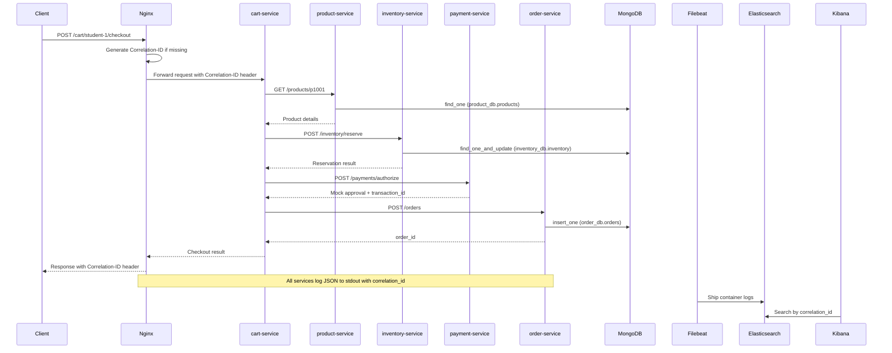

# Architecture

## Overview

This system demonstrates **log-based distributed tracing** using a shared `Correlation-ID` header and centralized structured JSON logs.

It intentionally avoids span-based tools (OpenTelemetry, Jaeger, Zipkin) so that students can see how distributed tracing works at the most fundamental level: structured log lines, a shared identifier, and a search engine.

## Request Flow

## Component Ports

| Component | Internal port | Host port |
|---|---|---|
| nginx | 80 | **8080** |
| product-service | 8001 | 8001 |
| cart-service | 8002 | 8002 |
| inventory-service | 8003 | 8003 |
| payment-service | 8004 | 8004 |
| order-service | 8005 | 8005 |
| mongodb | 27017 | 27017 |
| elasticsearch | 9200 | 9200 |
| kibana | 5601 | **5601** |

## Shared Utilities (`shared/`)

| Module | Responsibility |
|---|---|
| `correlation.py` | `CORRELATION_ID_HEADER` constant, header extraction |
| `logging_config.py` | `JSONFormatter`, `setup_logging()` factory |
| `http_client.py` | `call_service()` — forwarded header, outbound logging, retries |
| `retry.py` | Tenacity retry decorator (3 attempts) |
| `responses.py` | `with_correlation_id()` helper |
