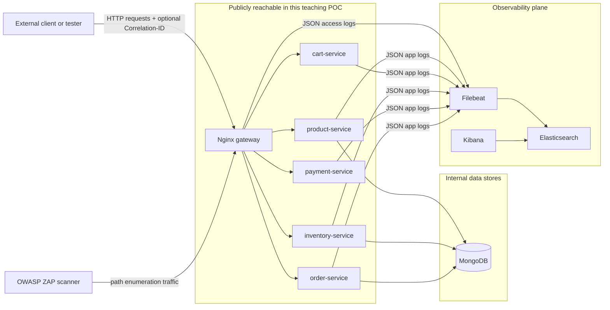

# Security Notes

This document explains the security principles demonstrated and reinforced by this project. It is written for IT security students.

---

## Correlation IDs

### What they are

A Correlation-ID is a unique identifier attached to a request when it enters the system. Every service that handles the request includes the same ID in its logs. This makes it possible to search one log store and reconstruct the complete path of a single request across multiple services.

### What they are NOT

- **Not authentication.** A Correlation-ID does not prove who made a request.
- **Not a secret.** Correlation-IDs are returned to the client in response headers. Anyone who sends a request receives the ID.
- **Not tamper-proof.** A client can supply any string as the `Correlation-ID` header. The system will accept and forward it.

### Should you trust a client-supplied Correlation-ID?

For incident investigation, accepting a client-supplied ID is useful — a developer or tester can set their own ID to make their requests easy to find in logs.

In a production system you might want to validate the format (e.g., must be a UUID) or ignore the client value entirely and always generate your own.

---

## Log Security

### Logs are evidence

In a security incident, logs are often the primary evidence used to understand what happened. Structured logs with correlation IDs make investigation faster and more reliable.

### Logs can also be a liability

If logs contain sensitive data, they become a high-value target for attackers. A database breach that exposes logs containing payment card numbers or passwords can make a moderate incident into a critical one.

### The rule: log metadata, not content

**You may log:**
- IDs (product IDs, order IDs, transaction IDs, user IDs)
- HTTP methods, paths, and status codes
- Durations and timestamps
- Service names and event names
- Counts and totals (amounts are OK; card numbers are not)

**You must never log:**
- Payment card numbers (PAN), CVV, or expiry dates — this would violate PCI DSS
- Passwords, password hashes, or password reset tokens
- Session tokens, API keys, or bearer tokens
- Personally Identifiable Information (PII) beyond what is necessary
- Full request or response bodies — these frequently contain secrets

### This project enforces these rules

No service in this project logs request bodies. The payment service logs `amount` and `currency` but not any card data. The order service logs `order_id` but not customer addresses or payment instrument details.

---

## Nginx as a Security Boundary

In this project, Nginx routes all five backend services publicly:

```text
/products/*    -> product-service
/cart/*        -> cart-service
/inventory/*   -> inventory-service
/payments/*    -> payment-service
/orders/*      -> order-service
```



This is done **intentionally for teaching purposes** so that students can call any service directly and observe individual service behaviour.

In a production system:
- Only client-facing endpoints should be exposed publicly (e.g., `/cart/*/checkout`)
- Internal service-to-service URLs should not be reachable from outside the private network
- Services like `inventory-service` and `order-service` should only be callable by `cart-service`, not by arbitrary external clients

---

## Intended and Non-Intended Use

This project is a local educational POC. It has no:
- Authentication or authorisation
- Rate limiting
- Input validation beyond Pydantic type checking
- TLS/HTTPS
- Secrets management

None of these omissions are acceptable in a production system. They are excluded here to keep the code readable and focused on the distributed tracing learning objective.

---

## Path Enumeration with OWASP ZAP

### Local Scope Warning

This scanner workflow is for authorized local lab use only.

- Target only the local Docker Compose gateway (`http://nginx:80` from containers, `http://localhost:8080` from host).
- Do not scan public hosts, production services, or systems you do not own.

### API-First Execution (PowerShell)

```powershell
docker compose up -d
powershell -ExecutionPolicy Bypass -File .\scripts\security_scan.ps1
```

The scan script is API-only and calls the ZAP HTTP API directly.

### Correlation-ID Behavior

The script creates one fixed correlation ID per scan run and injects it into every scanner request via ZAP replacer rules.

This lets you correlate scanner traffic in Kibana as one coherent activity stream.

### Wordlist Consumption Rule

Enumeration consumes all files under `./security/wordlists`.

- Empty lines and comment lines beginning with `#` are ignored.
- Paths from all files are merged and de-duplicated before requests are sent.

### API-Only Constraint

Spider/crawling discovery is intentionally excluded because this target is API-only.

### Kibana Query Examples

Find scanner traffic by fixed correlation ID:

```text
service_name:"nginx" AND correlation_id:"sec-scan-20260520_120000"
```

Find likely discovery requests in Nginx logs:

```text
service_name:"nginx" AND request_method:"GET" AND request_uri:/products|cart|inventory|payments|orders/
```

### Teaching Context

This project intentionally exposes broad service routes through Nginx to make attack-surface discovery visible for students.

In production, route exposure should be minimized and access controlled.
